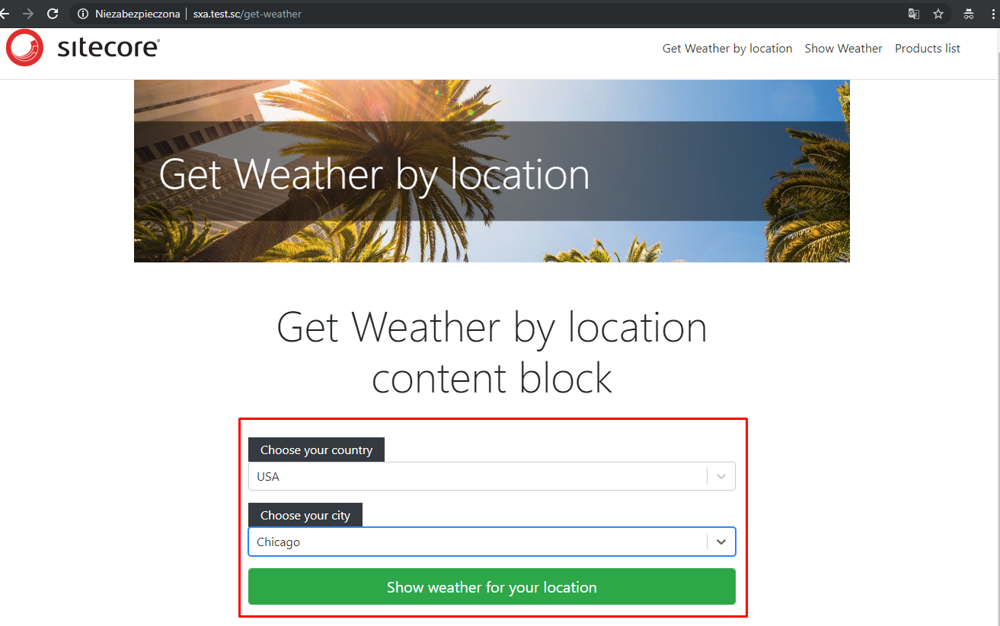

# Documentation


## Traveler Last Hope website/module

## Summary

**Category:** Best enhancement to JSS to change a JSS component rendering behavior based on user's session data

Goal of the module is help travelers in planning voyage.

Main goal of module is retrieve information from users about target of travel, show them weathercast 
and prompt them about what they may need in coming days (umbrella, winter hat, etc.)/
Module contains too simple shop in which user can buy necessary items. 
List of items depends on expected weather in the destination place. 

weathercast is retrieved from REST service delivered by https://openweathermap.org. Weather data are stored 
in user session, content of weathercast and shop pages is based on that data.    

Module was realized in form of JSS application, additionally:
- we make personalisation rules which controls of components depending on prognosis of weathercast
- we prepared implementation of IRenderingContentsResolver which modifies look and behavior of components based on user session 


## Pre-requisites

- Installed node.js (latest LTS version)
- Fresh Sitecore 9.1 installation
- Installed Sitecore JSS module Sitecore JavaScript Services Server for Sitecore 9.1 XP 11.0.0 rev. 181031.zip
- Visual Studio - add nuget Package Source: https://sitecore.myget.org/F/sc-platform-9-1/api/v3/index.json
- Api Key to access https://openweathermap.org REST API (free api key version included in source code)
- Nuget packages, among others: RestSharp, Newtonsoft.Json, Sitecore core packages from https://sitecore.myget.org (Kernel, MVC, etc.)


**Delete:**

Does your module rely on other Sitecore modules or frameworks?

- List any dependencies
- Or other modules that must be installed
- Or services that must be enabled/configured


## Installation

1. Install Sitecore JSS package
1. Add binding to website for `sxa.test.sc`
1. Add entry in localhost `127.0.0.1 sxa.test.sc`  
1. Use the Sitecore Installation wizard to install the [package](#../sc.package/tig.zip)


## Configuration

Module contains some sample products, if you want to add some more, go to  
- repository:/sitecore/content/traveler-last-hope/Content/Data/PMD/

Products filelds:
- Name - Product name
- Weather Type - Weather condition (sunny, rainy etc.) - used to filter products to those with user forecasted weather
- Image - product image
- Description - product description
- Price - product price

Website root is located under path: `/sitecore/content/traveler-last-hope/home`

Openweathermap.org API key - add .config file in /App_Config/Include folder :

```xml
<?xml version="1.0"?>
<configuration xmlns:patch="http://www.sitecore.net/xmlconfig/">
  <sitecore>
    <settings>
      <setting name="OpenwethermapApiKey" value="abcd123456789" />
    </settings>
  </sitecore>
</configuration>
```

## Usage

### "End user" use case:
- user start [website](#http://sxa.test.sc/get-weather)
- user select country and city of travel target 
- user browse weathercast for selected location 
- user navigates to shop page with proposed items to buy


### Sitecore - module key elements:
- website root: /sitecore/content/traveler-last-hope
- products repository: /sitecore/content/traveler-last-hope/Content/Data/PMD/Products
- renderings: /sitecore/layout/Renderings/Project/traveler-last-hope
- layouts: /sitecore/layout/Layouts/Project/traveler-last-hope
- placeholders settings: /sitecore/layout/Placeholder Settings/Project/traveler-last-hope
- templates: /sitecore/templates/Project/traveler-last-hope
- rules definition: /sitecore/system/Settings/Rules/Definitions/Elements/Tig | /sitecore/system/Settings/Rules/Definitions/Tags/Tig
- Layout Service customizations (custom resolvers): /sitecore/system/Modules/Layout Service/Rendering Contents Resolvers/TigLocationResolver | /sitecore/system/Modules/Layout Service/Rendering Contents Resolvers/TigProductResolver | /sitecore/system/Modules/Layout Service/Rendering Contents Resolvers/TigWeatherResolver


### Sitecore - Layout Service customizations:
To change behavior of some renderings, we created some custom Rendering Contents Resolvers. 
Purpose of this resolvers is to change "on the fly" some of the renderings data 
(for example: replace some location data or personalize products lists)


### Sitecore - Using weather personalization rule:
Weather data, that was fetched from external weather API, can be used to personalize website content. 
We prepared personalization rule that allow content editors to personalize website components.

Usage:
- Select website page item with (for example /sitecore/content/traveler-last-hope/home)
- Edit layout details, and go to Controls > Personalize
- In "Personalize the component" wizard add new rule and select rule from "Tig" section:

- select one or more weather types:


## Video

Video files:
- tig.mp4
- tig-additional.mp4

Please provide a video highlighing your Hackathon module submission and provide a link to the video. Either a [direct link](https://www.youtube.com/watch?v=EpNhxW4pNKk) to the video, upload it to this documentation folder or maybe upload it to Youtube...

[](https://www.youtube.com/watch?v=EpNhxW4pNKk)
